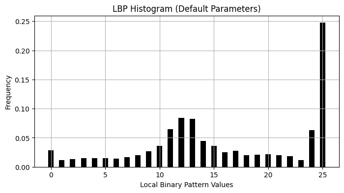

# HumanFaceToolbox

A Python toolbox for common human face image processing tasks, including Canny Edge Detection, Gabor Feature Extraction and other feature extraction methods like HOG, LBP, and Wavelet. This toolbox is designed to be modular, reusable, and easy to integrate into larger projects.

## Table of Contents

- [Features](#features)
- [Installation](#installation)
- [Usage](#usage)
  - [Canny Edge Detection Example](#canny-edge-detection-example)
  - [Gabor Feature Extraction Example](#gabor-feature-extraction-example)
  - [HOG Feature Extraction Example](#hog-feature-extraction-example)
  - [LBP Feature Extraction Example](#lbp-feature-extraction-example)
  - [Wavelet Feature Extraction Example](#wavelet-feature-extraction-example)
- [Project Structure](#project-structure)
- [Dependencies](#dependencies)
<!-- - [Running Tests](#running-tests) -->

## Features

- **Canny Edge Detection**: Apply Canny algorithm to detect edges in images.
- **Gabor Feature Extraction**: Extract texture features using Gabor filters with parallel processing.
- **HOG Feature Extraction**: Extract Histogram of Oriented Gradients features for object detection and recognition.
- **LBP Feature Extraction**: Extract Local Binary Pattern features for texture description.
- **Wavelet Feature Extraction**: Perform wavelet decomposition and reconstruction for image analysis and compression.
- **Utility Functions**: Common functions for image downloading and plotting.
- **Modular Design**: Easily extendable and maintainable.

## Installation

1.  **Clone the repository (if not already done):**
    ```bash
    git clone https://github.com/your-username/HumanFaceToolbox.git
    cd HumanFaceToolbox
    ```

2.  **Using Docker (Recommended for consistent environment):**
    To build the Docker image:
    ```bash
    docker build -t human-face-toolbox .
    ```
    To run a container and access the toolbox (e.g., to run an example):
    ```bash
    docker run -v $(pwd):/app -it human-face-toolbox bash
    # Once inside the container, you can run examples like:
    # python examples/canny_example.py
    ```

3.  **Manual Installation (Python Virtual Environment):**
    a.  **Create a virtual environment (recommended):**
        ```bash
        python -m venv venv
        source venv/bin/activate  # On Windows, use `venv\Scripts\activate`
        ```

    b.  **Install the required dependencies:**
        ```bash
        pip install -r requirements.txt
        ```

## Usage

**Note on Test Image:** The examples in this toolbox frequently use the "Lena" test image, a standard image in image processing research, often associated with Lena Söderberg (née Forsén). This image is widely used for benchmarking and demonstration purposes. Check out `https://en.wikipedia.org/wiki/Lenna` for more information.

You can find example scripts in the `examples/` directory that demonstrate how to use the functions provided in this toolbox.

### HOG Feature Extraction Example

To run the HOG Feature Extraction example:

```bash
python examples/hog_example.py
```

This script will:
1.  Download a sample image.
2.  Extract HOG features.
3.  Display the original, grayscale, and HOG feature images using `matplotlib`. It also demonstrates HOG extraction on a cropped region.


### Wavelet Feature Extraction Example

To run the Wavelet Feature Extraction example:

```bash
python examples/wavelet_example.py
```

This script will:
1.  Download a sample image.
2.  Perform wavelet decomposition and reconstruction.
3.  Display the original, reconstructed, and selected coefficient images using `matplotlib`.


### Canny Edge Detection Example

To run the Canny Edge Detection example:

```bash
python examples/canny_example.py
```

This script will:
1.  Download a sample image.
2.  Apply Canny edge detection.
3.  Display the original and edge-detected images using `matplotlib`.


### Gabor Feature Extraction Example

To run the Gabor Feature Extraction example:

```bash
python examples/gabor_example.py
```

This script will:
1.  Download a sample image.
2.  Extract Gabor features using multiple orientations and frequencies.
3.  Display all individual Gabor responses and a fused feature map using `matplotlib`.


### LBP Feature Extraction Example

To run the LBP Feature Extraction example:

```bash
python examples/lbp_example.py
```

This script will:
1.  Download a sample image.
2.  Extract LBP features with default and custom parameters.
3.  Display the original, grayscale, and LBP feature images using `matplotlib`, including a histogram of LBP values.




## Project Structure

```
HumanFaceToolbox/
├── src/
│   ├── __init__.py         # Marks src as a Python package
│   ├── utils.py            # Utility functions (image download, plotting)
│   ├── canny_edge.py       # Canny Edge Detection module
│   ├── gabor_features.py   # Gabor Feature Extraction module
│   ├── hog_features.py     # HOG Feature Extraction module
│   ├── lbp_features.py     # LBP Feature Extraction module
│   └── wavelet_features.py # Wavelet Feature Extraction module
├── examples/
│   ├── canny_example.py    # Example script for Canny Edge Detection
│   ├── gabor_example.py    # Example script for Gabor Feature Extraction
│   ├── hog_example.py      # Example script for HOG Feature Extraction
│   ├── lbp_example.py      # Example script for LBP Feature Extraction
│   └── wavelet_example.py  # Example script for Wavelet Feature Extraction
├── Dockerfile              # Dockerfile for containerized environment
├── requirements.txt        # List of Python dependencies
└── README.md               # Project documentation
```
<!-- 
├── tests/
│   ├── __init__.py         # Marks tests as a Python package
│   ├── test_canny_edge.py  # Unit tests for Canny Edge Detection
│   ├── test_gabor_features.py # Unit tests for Gabor Feature Extraction
│   ├── test_hog_features.py # Unit tests for HOG Feature Extraction
│   ├── test_lbp_features.py # Unit tests for LBP Feature Extraction
│   └── test_wavelet_features.py # Unit tests for Wavelet Feature Extraction -->

## Dependencies

The project relies on the following Python libraries:

-   `opencv-python`
-   `numpy`
-   `requests`
-   `matplotlib`
-   `scikit-image`
-   `Pillow`
-   `joblib`
-   `tqdm`

These dependencies are listed in `requirements.txt` and can be installed using `pip`.

<!-- 
## Running Tests

To run the unit tests for the toolbox, navigate to the root directory of the project and execute the following command:

```bash
python -m unittest discover tests
```

This command will discover and run all test files within the `tests/` directory. -->
